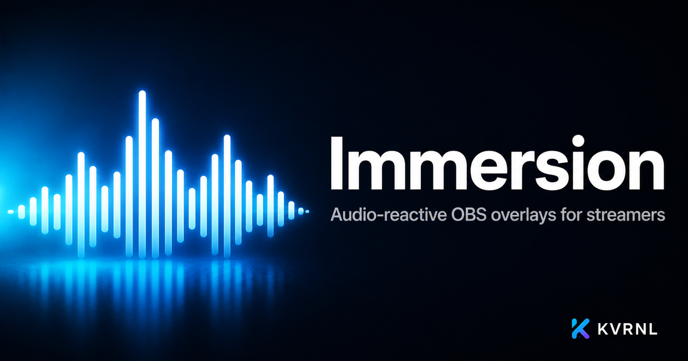

# Immersion

### Audio-reactive OBS overlays for streamers

 

Live synced lyrics that pulse to your music, plus visualizers, timers, counters, tickers, and goal bars — a whole audio-reactive overlay toolkit that runs from your system tray and drops straight into OBS.

### **[⬇&nbsp; Download Immersion — free at kvrnl.io](https://kvrnl.io/products/immersion/)**

 

---

## What it does

Immersion is an audio-reactive overlay toolkit for streamers. Its centerpiece is live, time-synced lyrics that pulse and animate in time with whatever's playing, so your stream moves with the music. Around that sits a full kit of broadcast widgets: spectrum and waveform visualizers, countdown and stopwatch timers, counters, scrolling tickers, and goal bars.

Everything runs quietly from the Windows system tray and adds into OBS as a browser source in seconds — style it, position it, and go live. Free to use; claim your license key and download it straight from this page.

## Features

- **Live synced lyrics that pulse to the music**
- **Spectrum & waveform audio visualizers**
- **Stream timers, counters, tickers & goal bars**
- **Runs in the system tray, drops into OBS**

## Download &amp; install

Immersion is **completely free**. Each install needs its own license key, which you get
with a free KVRNL account.

1. Go to **[kvrnl.io/products/immersion/](https://kvrnl.io/products/immersion/)**
2. Create a free account — email verification, nothing else
3. Claim your license key — instant, no waiting
4. Download and install

> [!NOTE]
> Immersion isn't code-signed yet, so Windows SmartScreen may warn you on first run.
> Click **More info → Run anyway**. Code signing is on the roadmap.

## Your license key

- **Free, one per product**, issued from your KVRNL account.
- **A key activates on one machine.** The first device to activate it claims it.
- **Switching computers?** Hit **Release device** on your
  [account page](https://kvrnl.io/account/) and the key is free to use again.
- Keys are checked over HTTPS at launch. See [Privacy](#privacy).

## Requirements

- **Windows 10 or 11** (64-bit)
- A free [KVRNL account](https://kvrnl.io/signup/) for your license key

## Privacy

Immersion sends KVRNL only what's needed to validate your license: **the key, the
product name, and a hardware ID**. No telemetry, no analytics, no tracking, and
none of your files. Full policy: **[kvrnl.io/privacy](https://kvrnl.io/privacy/)**

## What's new

**v1.0.8** — 2026-09-26
  - Immersion now shares basic usage info with KVRNL to help fix problems and improve the app: which overlays you use and how long they're live, your Windows version and PC hardware. Nothing about your music, lyrics or stream is ever sent.
  - You can turn usage info off any time in Settings. A one-time notice explains it the first time you open Immersion after this update.
  - When usage info is on, problems like audio capture failing are reported automatically, so they get fixed faster.

**v1.0.7** — 2026-09-25
  - New activation screen with clear steps for getting your free key, so it's easy even if you downloaded Immersion from somewhere other than kvrnl.io.
  - Paste button for your key, and Immersion now spots a key you've copied. Extra spaces or odd dashes from copying no longer cause errors.
  - When a key can't be activated, you get a clear explanation and a one-click link to fix it, like releasing your key from another PC.
  - Immersion stays fully locked until it's activated. If a key is released while the app is open, overlays and hotkeys pause until you activate again.
  - If KVRNL's activation service briefly has trouble, an already-activated PC keeps working instead of asking for the key again.
  - Activation now works on networks that use a proxy.

**v1.0.6** — 2026-09-06
  - Visualizer overhaul: bars now cover the whole musical range evenly (the bass end used to be a block of identical bars and the top end sat flat), move smoothly instead of flickering, and the glow is far lighter on your PC so it stays at 60 fps in OBS. Wave style is now a smooth curve.
  - 'Pulse to the beat' actually pulses now: beat detection picks up kicks much more reliably, and the timer and counter bounce is bigger and easier to see.
  - The audio engine restarts itself when you switch output devices (speakers to headphones, a new USB device), so the visualizer no longer goes dead until you relaunch.
  - Now-playing strip in the control panel: long titles trim cleanly and the lyrics status sits in its own slot instead of crowding the title.
  - A beat light in the Audio meter blinks on every beat Immersion hears, so you can tell at a glance that the pulse is working.
  - Smoother control panel while dragging sliders.

**v1.0.5** — 2026-09-06
  - Updates now install and restart Immersion automatically, the same way the other KVRNL apps do. No more downloading the installer yourself.
  - If OBS has overlays open when an update finishes downloading, Immersion waits until they've been off air for a couple of minutes before restarting, so a live stream never loses its overlays. A green 'ready — restart now' button appears at the top if you'd rather not wait.
  - 'Check for updates' in Settings now downloads and installs directly, with a progress bar, instead of sending you to a browser download.

**v1.0.4** — 2026-09-06
  - Brand-new control panel, rebuilt from the ground up: cleaner layout, clearer flow, and nothing gets cut off at the window edge any more — every section scrolls on its own.
  - A status strip across the top shows what's playing, whether Immersion can hear your audio, and that the overlay server is up.
  - Each overlay page now leads with a true-to-size live preview and a one-click 'Add to OBS' strip: the URL, the exact width/height, and the FPS to use.
  - Live controls moved up front: big readouts for counters, timers and goals, one-click countdown presets, and a 'set to' box for counters.
  - The lyrics page shows the current line as it plays; the visualizer page shows live audio levels and BPM so you can tell at a glance that capture works.
  - Hotkeys are now recorded by pressing the keys, with a warning if a combo is already taken by another app.
  - Appearance settings use sliders, colour swatches, switches and segmented controls, plus a one-click reset to defaults.
  - Ticker messages are a proper list you can add to, edit, reorder and remove.
  - Adding an overlay is a picker with a description and OBS size for each type; removing one asks first.
  - A quick three-step guide appears on first use, and the activation window got the same fresh look.

Full history → **[kvrnl.io/changelog/immersion](https://kvrnl.io/changelog/immersion/)**

## Documentation

Setup guides and how-tos → **[kvrnl.io/docs/immersion](https://kvrnl.io/docs/immersion/)**

## Support

> [!IMPORTANT]
> **We don't use GitHub Issues.** Report bugs from inside the app — it's the
> fastest route to us and it attaches the details we need automatically.

- 🐛 **Found a bug?** Use **Report a Problem** inside Immersion
- 💬 **Chat with us** → **[Discord](https://discord.gg/Ub4SdAuhu)**
- ✉️ **Anything else** → **[kvrnl.io/contact](https://kvrnl.io/contact/)**
- ❓ **FAQ** → [kvrnl.io/faq](https://kvrnl.io/faq/)

## License

**Proprietary freeware — free to use, not open source.**

This repository hosts the installer releases, documentation, and license for
Immersion. **The application source code is not published.** See
**[LICENSE](./LICENSE)** for the full terms.

---

 

**[kvrnl.io](https://kvrnl.io)** &nbsp;·&nbsp; **[All products](https://kvrnl.io/products/)** &nbsp;·&nbsp; **[Changelog](https://kvrnl.io/changelog/)** &nbsp;·&nbsp; **[Discord](https://discord.gg/Ub4SdAuhu)** &nbsp;·&nbsp; **[Contact](https://kvrnl.io/contact/)**

© 2026 <b>KVRNL</b> — an AI-powered software studio shipping free desktop tools.

